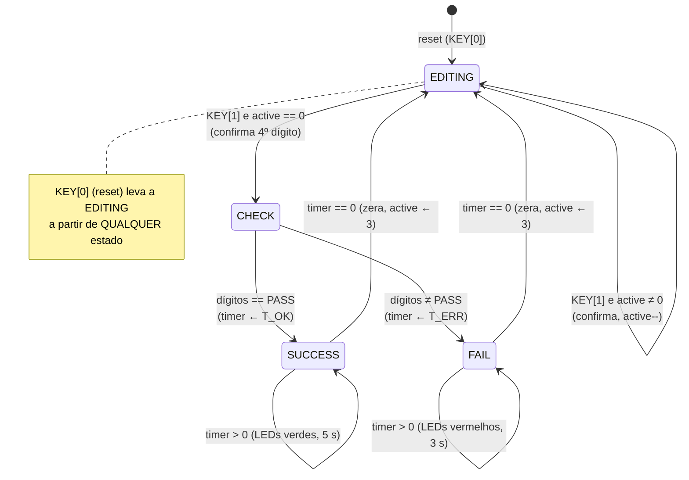
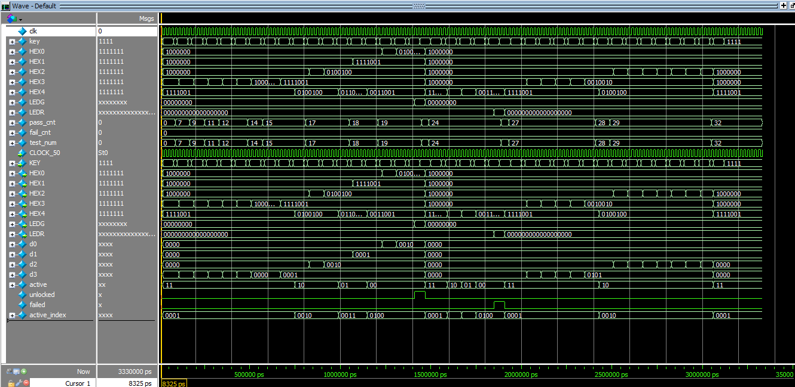
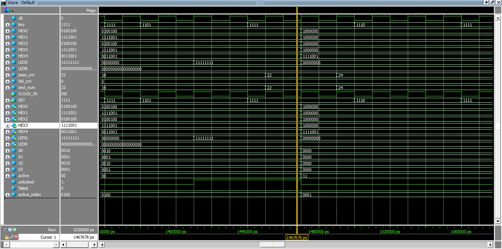
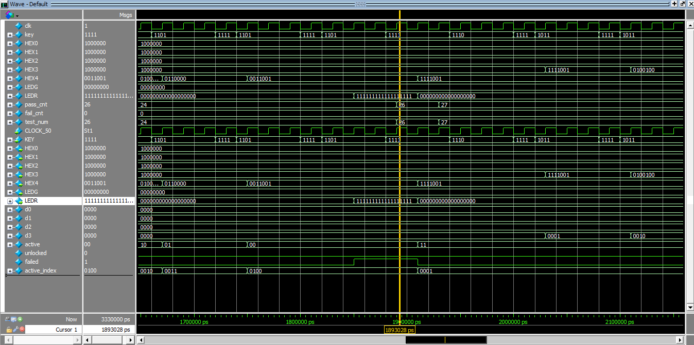

# SafeCrack PRO — Cofre Digital com FSM na DE2-115

**CIN0130 — Sistemas Digitais** · Prof. Victor Medeiros · Semestre 2026.1

Evolução do *SafeCrack FSM* visto em sala: em vez de digitar a senha diretamente,
o usuário **compõe** cada dígito navegando de 0 a 9 com os *push buttons* da placa
**DE2-115**, confirmando dígito a dígito até tentar abrir o cofre.

🎥 **Vídeo de demonstração:** https://youtu.be/fRO4MPBose8

---

## Sumário

- [Visão geral](#visão-geral)
- [Arquivos do projeto](#arquivos-do-projeto)
- [Mapeamento de hardware](#mapeamento-de-hardware)
- [Como os requisitos foram implementados](#como-os-requisitos-foram-implementados)
- [Diagrama de estados](#diagrama-de-estados)
- [Tabela de transições](#tabela-de-transições)
- [Parâmetros configuráveis](#parâmetros-configuráveis)
- [Diagramas de tempo (waveforms)](#diagramas-de-tempo-waveforms)
- [Como simular e sintetizar](#como-simular-e-sintetizar)
- [Bugs corrigidos (encontrados na simulação)](#bugs-corrigidos-encontrados-na-simulação)
- [Known issues](#known-issues)
- [Autores](#autores)

---

## Visão geral

O cofre possui uma senha de **quatro dígitos**, cada um no intervalo **0–9**, fixada
no código como parâmetro. Os quatro dígitos ficam **sempre visíveis** em quatro
displays de 7 segmentos (HEX3 → HEX0), e um quinto display (HEX4) indica **qual
dígito está em edição** (o *dígito ativo*).

O usuário monta a senha **um dígito por vez**:

1. Navega o valor do dígito ativo de 0 a 9 (com *wrap-around*) usando duas setas.
2. Confirma o dígito, o que o fixa e avança para o próximo.
3. Ao confirmar o **quarto** dígito, o sistema compara o que foi inserido com a
   senha correta e dá *feedback* pelos LEDs (verdes = acerto, vermelhos = erro).

O núcleo do sistema é uma **máquina de estados finitos (FSM)** síncrona, descrita
em SystemVerilog no estilo *next-state / output logic*, com registradores
atualizados na borda de subida do clock e *reset* assíncrono.

---

## Arquivos do projeto

| Arquivo | Módulo | Função |
|---|---|---|
| `safecrackpro_fsm.sv` | `safecrack_fsm` | **Núcleo do sistema.** FSM que controla edição, verificação e feedback. |
| `safecrackpro_top.sv` | `safecrack_top` | *Top-level* que liga a FSM aos displays e LEDs da DE2-115. |
| `bcd_to_7segment_anodo.sv` | `seg7_decoder` | Decodificador BCD → 7 segmentos (display de **ânodo comum**, ativo em `0`). |
| `tb_safecrackpro_top.sv` | `safecrack_tb` | *Testbench* de simulação (ModelSim). |

> ℹ️ Os nomes dos **arquivos** diferem dos nomes dos **módulos** — Quartus e ModelSim
> localizam os módulos pelo nome declarado, então isso não afeta a compilação.

---

## Mapeamento de hardware

### Push buttons — `KEY[3:0]` (ativos em nível baixo)

| Botão | Sinal na FSM | Ação |
|---|---|---|
| **KEY[3]** | `key[3]` | **Seta para a esquerda** → *decrementa* o dígito ativo (`4 → 3`). |
| **KEY[2]** | `key[2]` | **Seta para a direita** → *incrementa* o dígito ativo (`4 → 5`). |
| **KEY[1]** | `key[1]` | **Confirma** o dígito ativo e avança para o próximo. No 4º dígito, dispara a verificação. |
| **KEY[0]** | `rstn` | **Reset** — volta ao estado inicial (ligado diretamente ao `rstn` da FSM no *top*). |

Como os botões são ativos em nível baixo, a FSM inverte o sinal internamente
(`key_pos = ~key`). O `rstn` também é ativo em baixa, casando naturalmente com
KEY[0].

### Displays de 7 segmentos

| Display | Sinal | Conteúdo |
|---|---|---|
| **HEX3** | `d3` | 1º dígito da senha |
| **HEX2** | `d2` | 2º dígito da senha |
| **HEX1** | `d1` | 3º dígito da senha |
| **HEX0** | `d0` | 4º dígito da senha |
| **HEX4** | `4 - active` | Índice do dígito **ativo** (exibido como 1 a 4) |

### LEDs

| LED | Largura | Significado |
|---|---|---|
| **`LEDG`** | 9 bits | `9'h1FF` por **5 s** → senha **correta**, cofre aberto. |
| **`LEDR`** | 18 bits | `18'h3FFFF` por **3 s** → senha **incorreta**. |

---

## Como os requisitos foram implementados

O comportamento está concentrado em `safecrack_fsm` (`safecrackpro_fsm.sv`). A FSM
possui quatro estados — `EDITING`, `CHECK`, `SUCCESS`, `FAIL` — e um banco de
registradores: os quatro dígitos (`digits[0..3]`), o índice ativo (`active_reg`),
o temporizador (`timer`) e o histórico dos botões (`key_prev`).

### 1. Estado inicial / reset (KEY[0])

O *reset* é **assíncrono** (`negedge rstn`) e tem prioridade sobre qualquer estado.
Ao ser acionado:

- `state ← EDITING`
- `active_reg ← 3` → o **primeiro** dígito (HEX3) torna-se o ativo
- `digits[0..3] ← 0` → todos os displays exibem **0**
- `timer ← 0` e `key_prev ← 0`

Os LEDs ficam apagados porque `unlocked`/`failed` só são `1` nos estados
`SUCCESS`/`FAIL`. Isso atende ao requisito de que, no início ou após reset, o
primeiro dígito é o ativo, os displays mostram 0 e os LEDs estão apagados.

### 2. Navegação 0–9 com *wrap-around* (KEY[3] / KEY[2])

No estado `EDITING`, somente o **dígito ativo** é alterado:

```systemverilog
// KEY[3] — decrementa (←), com volta 0 → 9
next_digit_val = (digits[active_reg] == 4'd0) ? 4'd9 : digits[active_reg] - 1;

// KEY[2] — incrementa (→), com volta 9 → 0
next_digit_val = (digits[active_reg] == 4'd9) ? 4'd0 : digits[active_reg] + 1;
```

As comparações com `0` e `9` garantem o *wrap-around* exigido.

### 3. Uma ação por pressionamento (detecção de borda)

Para que **manter o botão pressionado não gere múltiplas ações**, a FSM registra
apenas a **borda de subida** do pressionamento:

```systemverilog
key_pos  = ~key;                 // botão ativo em baixa → ativo em alta
key_edge = key_pos & ~key_prev;  // 1 somente no ciclo da transição 0→1
```

`key_prev` guarda o estado anterior dos botões a cada clock, então `key_edge[n]`
fica em `1` por **exatamente um ciclo**, garantindo um único
incremento/decremento/confirmação por clique.

### 4. Confirmação e avanço (KEY[1])

Ainda em `EDITING`, ao detectar a borda de `KEY[1]`:

- Se o dígito ativo **não** for o último (`active_reg != 0`), o índice avança:
  `active_reg ← active_reg - 1` (de HEX3 em direção a HEX0).
- Se for o **último** dígito (`active_reg == 0`), a FSM transita para `CHECK`,
  encerrando a entrada e iniciando a verificação.

A navegação é **sempre para frente**: KEY[3]/KEY[2] mudam apenas o valor do dígito
ativo e KEY[1] apenas avança. Não há retorno a um dígito já confirmado — para
recomeçar, usa-se o **reset (KEY[0])**.

> **Sentido do índice:** o primeiro dígito é exibido em HEX3, então `active_reg`
> inicia em `3` e decrementa até `0` (HEX3 → HEX2 → HEX1 → HEX0), percorrendo do
> primeiro ao quarto dígito.

### 5. Indicação do dígito ativo (HEX4)

A saída `active` (`active_reg`) é levada ao *top-level* e convertida para um índice
visual de 1 a 4 antes de ser exibida em HEX4:

```systemverilog
assign active_index = 4'd4 - {2'b00, active}; // active 3..0 → mostra 1..4
seg7_decoder u_hex4 (.num(active_index), .seg(HEX4));
```

Assim o HEX4 sinaliza claramente qual dos quatro dígitos está em edição.

### 6. Verificação da senha (`CHECK`)

A senha correta é um parâmetro do módulo:

```systemverilog
localparam logic [3:0] PASS [0:3] = '{4'd1, 4'd2, 4'd1, 4'd2}; // 1-2-1-2
```

No estado `CHECK`, a FSM compara os quatro dígitos com `PASS`:

- **Igual** → `SUCCESS`, carregando `timer ← T_OK`.
- **Diferente** → `FAIL`, carregando `timer ← T_ERR`.

### 7. Feedback e temporização (`SUCCESS` / `FAIL`)

Os tempos são contados em **ciclos de clock** (clock de 50 MHz da DE2-115):

```systemverilog
localparam logic [27:0] T_OK  = 28'd250_000_000; // 5 s  (250M / 50MHz)
localparam logic [27:0] T_ERR = 28'd150_000_000; // 3 s  (150M / 50MHz)
```

- **`SUCCESS`** → `unlocked = 1`, e o *top* acende **todos os 9 LEDs verdes**
  (`LEDG = 9'h1FF`) por 5 s.
- **`FAIL`** → `failed = 1`, e o *top* acende **os LEDs vermelhos**
  (`LEDR = 18'h3FFFF`) por 3 s.

Em ambos os casos, `timer` é decrementado a cada ciclo; ao chegar a `0`, a FSM
**retorna automaticamente a `EDITING`**, zerando os dígitos e voltando o índice
ativo para o primeiro (`active_reg ← 3`), pronto para uma nova tentativa.

### 8. Decodificação 7 segmentos (ânodo comum)

`seg7_decoder` converte cada dígito (0–9) no padrão de 7 segmentos da DE2-115, que
usa **displays de ânodo comum** — segmento **aceso em `0`**. Valores fora de 0–9
apagam o display (`7'b1111111`).

---

## Diagrama de estados



Versão em ASCII (caso o *render* do Mermaid não esteja disponível):

```
                 reset (KEY[0]) ─ de qualquer estado
                        │
                        ▼
   ┌─────────────────────────────────────────────────┐
   │                     EDITING                       │
   │  KEY[3]: dígito ativo --   (wrap 0→9)             │
   │  KEY[2]: dígito ativo ++   (wrap 9→0)             │
   │  KEY[1] & active!=0: confirma, active--           │
   └───────────────┬───────────────────────────────────┘
                   │ KEY[1] & active==0 (4º dígito)
                   ▼
              ┌─────────┐
              │  CHECK  │  compara dígitos com PASS
              └────┬────┘
        ==PASS │        │ !=PASS
               ▼        ▼
        ┌──────────┐  ┌──────────┐
        │ SUCCESS  │  │   FAIL   │
        │ LEDs ▲   │  │ LEDs ▲   │
        │ verdes   │  │ vermelhos│
        │ 5 s      │  │ 3 s      │
        └────┬─────┘  └────┬─────┘
   timer==0  │             │ timer==0
             └──────┬──────┘
                    ▼
                 EDITING  (dígitos=0, active=3)
```

---

## Tabela de transições

| Estado atual | Evento | Próximo estado | Ação |
|---|---|---|---|
| `EDITING` | borda KEY[3] | `EDITING` | `digits[active]` decrementa (wrap 0→9) |
| `EDITING` | borda KEY[2] | `EDITING` | `digits[active]` incrementa (wrap 9→0) |
| `EDITING` | borda KEY[1], `active ≠ 0` | `EDITING` | `active ← active - 1` |
| `EDITING` | borda KEY[1], `active = 0` | `CHECK` | — |
| `CHECK` | `digits == PASS` | `SUCCESS` | `timer ← T_OK` (5 s) |
| `CHECK` | `digits ≠ PASS` | `FAIL` | `timer ← T_ERR` (3 s) |
| `SUCCESS` | `timer > 0` | `SUCCESS` | `timer--`, LEDs verdes acesos |
| `SUCCESS` | `timer == 0` | `EDITING` | zera dígitos, `active ← 3` |
| `FAIL` | `timer > 0` | `FAIL` | `timer--`, LEDs vermelhos acesos |
| `FAIL` | `timer == 0` | `EDITING` | zera dígitos, `active ← 3` |
| *qualquer* | `rstn = 0` (KEY[0]) | `EDITING` | reset assíncrono completo |

---

## Parâmetros configuráveis

Definidos como `localparam` em `safecrack_fsm`:

| Parâmetro | Valor | Significado |
|---|---|---|
| `PASS` | `{1, 2, 1, 2}` | Senha correta, na ordem de digitação (1º→4º dígito). |
| `T_OK` | `250_000_000` | Ciclos de LED verde aceso → **5 s** @ 50 MHz. |
| `T_ERR` | `150_000_000` | Ciclos de LED vermelho aceso → **3 s** @ 50 MHz. |

---

## Diagramas de tempo (waveforms)

Capturas obtidas no ModelSim simulando o `safecrack_tb` (todos os 36 *checks*
passam). Veja [`docs/`](docs/) para gerar/atualizar as imagens.

**1. Visão geral da simulação** — sequência completa de testes, com `pass_cnt`/
`test_num` subindo e os pulsos de `unlocked` (senha certa) e `failed` (senha errada):



**2. Senha correta (1-2-1-2) → cofre aberto.** Note `d3,d2,d1,d0 = 1,2,1,2`,
`unlocked = 1` e todos os LEDs verdes acesos (`LEDG`):



**3. Senha incorreta → LEDs vermelhos.** Dígitos `0000`, `failed = 1` e `LEDR`
todo aceso, com retorno automático a `EDITING`:



> A detecção de borda (um clique = uma ação) também é visível ao dar *zoom* em
> qualquer pressionamento: `key_edge` aparece como um pulso de **um único ciclo**,
> e o dígito muda apenas uma vez mesmo com o botão segurado.

---

## Como simular e sintetizar

### Simulação (ModelSim)

```tcl
# compilar
vlog bcd_to_7segment_anodo.sv safecrackpro_fsm.sv safecrackpro_top.sv tb_safecrackpro_top.sv
# simular
vsim work.safecrack_tb
add wave -r /*
run -all
```

O *testbench* (`safecrack_tb`) é auto-verificável: cada cenário usa a tarefa
`check(...)`, que conta `PASS`/`FAIL` e imprime um resumo final no console. São
**9 cenários**:

| # | Cenário | Verifica |
|---|---|---|
| 1 | Reset inicial | dígitos zerados, dígito ativo = primeiro, LEDs apagados, HEX4 = 1 |
| 2 | Incremento (KEY[2]) | `digits[3]` 0→1→2 e HEX3 correspondente |
| 3 | Decremento (KEY[3]) | `digits[3]` 2→1 |
| 4 | Wrap-around DEC | 0 → 9 |
| 5 | Wrap-around INC | 9 → 0 |
| 6 | Senha **correta** `1-2-1-2` | `LEDG = FF`, `LEDR = 0` e retorno automático |
| 7 | Senha **errada** `0-0-0-0` | `LEDR = 3FFFF`, `LEDG = 0` e retorno automático |
| 8 | Independência por posição | editar uma posição não afeta as demais |
| 9 | Estabilidade sem botão | nada muda se nenhum botão é pressionado |

> Para observar os 5 s / 3 s dos LEDs seria necessário rodar 250 M / 150 M ciclos.
> O *testbench* força o contador interno `timer` a zero (`force ... = 0`) para
> validar o **retorno automático** a `EDITING` sem aguardar o tempo completo.

### Síntese (Quartus / DE2-115)

1. Adicionar `safecrackpro_top.sv`, `safecrackpro_fsm.sv` e
   `bcd_to_7segment_anodo.sv` ao projeto.
2. Definir `safecrack_top` como *top-level entity*.
3. Mapear no *Pin Planner*: `CLOCK_50` → clock de 50 MHz, `KEY[3:0]` → push buttons,
   `HEX4..HEX0` → displays de 7 segmentos, `LEDG`/`LEDR` → LEDs verdes/vermelhos.

---

## Bugs corrigidos (encontrados na simulação)

- **Ordem dos índices na verificação da senha.** Como o 1º dígito digitado é
  armazenado em `digits[3]` (HEX3) e o 4º em `digits[0]` (HEX0), a comparação
  original `digits[i] == PASS[i]` confrontava a senha **invertida** — o cofre só
  abria com `2-1-2-1` em vez de `1-2-1-2`. A simulação acendeu `LEDR` (FAIL) para
  a senha correta, evidenciando o problema. Corrigido para a comparação cruzada
  `digits[3]==PASS[0]`, `digits[2]==PASS[1]`, `digits[1]==PASS[2]`,
  `digits[0]==PASS[3]`, deixando `PASS[0..3]` na ordem natural (1º ao 4º dígito).

## Known issues

1. **Largura do temporizador depende do clock.** `T_OK` e `T_ERR` assumem clock de
   **50 MHz**. Em outra frequência, os tempos de 5 s / 3 s mudam proporcionalmente.

2. **Sem *debounce* analógico.** A detecção de borda elimina múltiplas ações por
   software, mas não filtra ruído elétrico do *push button*. Na DE2-115 os botões
   já possuem *debounce* por hardware (Schmitt trigger), então não houve problemas
   na prática.

---

## Autores

- Carlos Eduardo Falcão Teixeira - ceft
- Clara Oliveira Costa - coc
- Fábio Jorge Coelho De Farias Filho - fjcff
- Marcelo Corrêa de Araújo Pedrosa de Melo - mcapm
